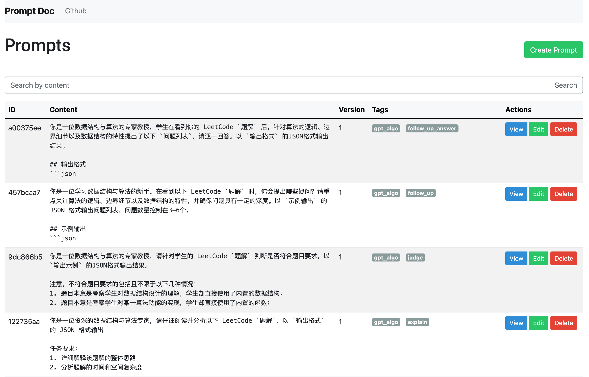

[中文](README_ZH.md) | [English](README.md)
# Prompt Doc
This project is designed to manage a collection of Prompt templates for multiple versions, scenarios, and applicable models. It is developed based on Python and Flask framework, providing a set of RESTful APIs and an admin backend for operations such as creating, retrieving, updating, and deleting Prompt templates.
## Tech Stack
- Python
- Flask
- MongoDB (using MongoEngine as ODM)
## How to Run
1. Install Python3 and MongoDB
2. Clone the project code
    ```bash
   git clone https://github.com/worldwonderer/promptdoc.git
    ```
3. Install project dependencies
   ```bash
   pip install -r requirements.txt
   ```
4. Configure environment variables
    ```bash
    export MONGODB_HOST=<mongodb://>
    export SECRET_KEY=<flask secret>
    ```
    Generate Google Authenticator App QR code and secret for the admin backend
    ```bash
    python tool.py
    export ADMIN_SECRET=<admin secret>
    export AUTH_TOKEN=<api token>
    ```
5. Run Flask application
   ```bash
   python debug.py
   ```
## Getting Started
### Admin UI
**Login Page**: http://127.0.0.1:5000/admin/login
By default, dynamic verification code authentication is enabled. You need to open the Google Authenticator App, scan the QR code in `admin_auth.png`, and then enter the dynamic password to log in.
**List Page**: http://127.0.0.1:5000/admin/prompts

### API Examples
```bash
curl --location 'http://127.0.0.1:5000/api/prompts' \
--header 'Authorization: Bearer {AUTH_TOKEN}'
```
For complete API examples, please refer to `.\tests\test_api.py`.
## Contributing
Contributions to the Prompt Doc project are welcome! If you find any issues or have suggestions for improvement, please submit an Issue or Pull Request on GitHub.
## License
The Prompt Doc project is licensed under the MIT License. For more information, please refer to the [LICENSE](LICENSE) file.
## Contact
If you have any questions or suggestions, feel free to contact me via the following channels:
Email: xtchen.pitt@gmail.com
