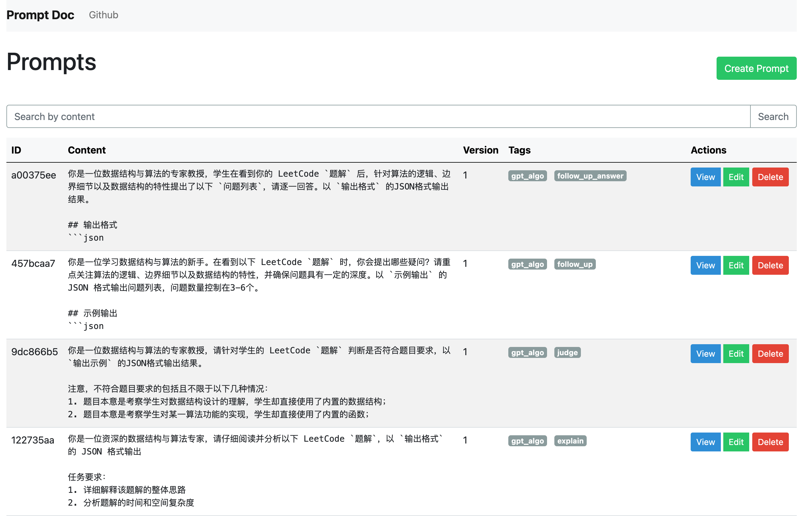

[中文](README_ZH.md) | English

# Prompt Doc

[](LICENSE) [](https://python.org) [](https://flask.palletsprojects.com) [](https://www.mongodb.com)

A lightweight prompt template management platform for creating, versioning, and serving LLM prompt templates via RESTful APIs with a built-in admin dashboard.

## Features

- **Multi-version Prompt Management** — Organize prompts by version, scenario, and target LLM model
- **RESTful API** — Full CRUD operations with Bearer token authentication
- **Admin Dashboard** — Web-based UI with TOTP (Google Authenticator) two-factor authentication
- **Variable Preview** — Substitute `{{variables}}` with example values and preview rendered output
- **Search & Filter** — Paginated listing with full-text search and tag-based filtering

## Tech Stack

| Component | Technology | Version |
|-----------|-----------|---------|
| Web Framework | [Flask](https://flask.palletsprojects.com) | 3.0.3 |
| ODM | [MongoEngine](http://mongoengine.org) | 0.28.2 |
| Flask-MongoEngine | [flask-mongoengine-3](https://pypi.org/project/flask-mongoengine-3/) | 1.0.9 |
| Serialization | [marshmallow](https://marshmallow.readthedocs.io) + marshmallow-mongoengine | 3.21.2 / 0.31.2 |
| 2FA | [pyotp](https://pypi.org/project/pyotp/) | 2.9.0 |
| Database | [MongoDB](https://www.mongodb.com) | 4.0+ |
| Testing | [pytest](https://pytest.org) | 8.2.0 |

## Quick Start

### Prerequisites

- Python 3.8+
- MongoDB 4.0+ running locally or remotely

### Installation

1. **Clone the repository**

   ```bash
   git clone https://github.com/worldwonderer/promptdoc.git
   cd promptdoc
   ```

2. **Install dependencies**

   ```bash
   pip install -r requirements.txt
   ```

3. **Configure environment variables**

   ```bash
   export MONGODB_HOST="mongodb://localhost:27017/prompt"
   export SECRET_KEY="your-flask-secret-key"
   ```

4. **Set up admin authentication**

   Generate a TOTP secret and QR code for Google Authenticator:

   ```bash
   python tool.py
   ```

   This produces an `admin_auth.png` QR code. Scan it with the Google Authenticator app, then export the displayed secret:

   ```bash
   export ADMIN_SECRET="the-secret-from-tool-output"
   export AUTH_TOKEN="your-api-bearer-token"
   ```

5. **Run the development server**

   ```bash
   python debug.py
   ```

   The server starts at `http://127.0.0.1:5000`. Note: `debug.py` is intended for local development only.

## API Reference

All API endpoints require Bearer token authentication via the `Authorization` header.

### List Prompts

```
GET /api/prompts
```

**Query Parameters:**

| Parameter | Type | Default | Description |
|-----------|------|---------|-------------|
| `page` | integer | 1 | Page number (≥ 1) |
| `per_page` | integer | 10 | Items per page (1–100) |
| `tag` | string | — | Filter by tag |
| `search` | string | — | Full-text search in prompt content |

**Example:**

```bash
curl -s "http://127.0.0.1:5000/api/prompts?page=1&per_page=10" \
  -H "Authorization: Bearer YOUR_AUTH_TOKEN"
```

**Response:**

```json
{
  "data": [
    {
      "prompt_id": "uuid-string",
      "content": "You are a {{role}}...",
      "variables": ["role"],
      "example": {"role": "helpful assistant"},
      "version": "1",
      "applicable_llm": "GPT-4",
      "tags": ["general", "chat"],
      "created_at": "2024-01-01T00:00:00",
      "updated_at": "2024-01-01T00:00:00"
    }
  ],
  "pagination": {
    "total_count": 1,
    "page": 1,
    "per_page": 10,
    "total_pages": 1
  }
}
```

### Create Prompt

```
POST /api/prompt
```

**Request Body:**

```json
{
  "content": "You are a {{role}} expert in {{domain}}.",
  "variables": ["role", "domain"],
  "example": {"role": "senior", "domain": "machine learning"},
  "version": "1",
  "applicable_llm": "GPT-4",
  "tags": ["expert", "domain"]
}
```

**Response:** `201 Created`

```json
{
  "message": "Prompt created successfully",
  "prompt_id": "generated-uuid"
}
```

### Get Prompt Detail

```
GET /api/prompt/<prompt_id>
```

**Response:** `200 OK` — Returns the prompt object.

### Update Prompt

```
PUT /api/prompt/<prompt_id>
```

**Request Body:** Include only the fields to update. All fields are optional.

**Response:** `200 OK`

```json
{
  "message": "Prompt updated successfully"
}
```

### Delete Prompt

```
DELETE /api/prompt/<prompt_id>
```

**Response:** `200 OK`

```json
{
  "message": "Prompt deleted successfully"
}
```

## Admin UI

The admin dashboard provides a visual interface for managing prompts.

### Access

1. Navigate to **Login Page**: `http://127.0.0.1:5000/admin/login`
2. Open Google Authenticator and enter the dynamic code from the QR code generated by `tool.py`
3. After login, you'll see the **Prompt List**: `http://127.0.0.1:5000/admin/prompts`

### Capabilities

- **Browse & Search** — Paginated list with tag filtering and content search
- **Create & Edit** — Form-based prompt editing with field validation
- **Variable Preview** — View rendered prompts with `{{variable}}` substitution using example values
- **Delete** — Remove prompts with one click



## Project Structure

```
promptdoc/
├── api/
│   ├── __init__.py         # Package init
│   ├── config.py           # App configuration & env vars
│   ├── models.py           # MongoDB document models (Prompt, PromptSchema)
│   ├── index.py            # Flask app factory & blueprint registration
│   ├── api_routes.py       # RESTful API endpoints (/api/*)
│   ├── admin_routes.py     # Admin UI routes (/admin/*)
│   └── templates/          # Jinja2 HTML templates
├── tests/
│   └── test_api.py         # API test suite (pytest)
├── tool.py                 # TOTP secret & QR code generator
├── debug.py                # Development server entry point
├── requirements.txt        # Python dependencies
├── vercel.json             # Vercel deployment config
├── README.md               # English documentation
└── README_ZH.md            # Chinese documentation
```

## Configuration

| Variable | Required | Description |
|----------|----------|-------------|
| `MONGODB_HOST` | Yes | MongoDB connection URI (e.g., `mongodb://localhost:27017/prompt`) |
| `SECRET_KEY` | Yes | Flask session secret key |
| `ADMIN_SECRET` | Yes | TOTP secret for admin login (generated by `tool.py`) |
| `AUTH_TOKEN` | Yes | Bearer token for API authentication |

## Contributing

Contributions are welcome! To contribute:

1. Fork the repository
2. Create a feature branch (`git checkout -b feature/my-feature`)
3. Commit your changes (`git commit -m 'Add my feature'`)
4. Push to the branch (`git push origin feature/my-feature`)
5. Open a Pull Request

Please ensure tests pass before submitting:

```bash
pytest tests/
```

## License

This project is licensed under the MIT License. See the [LICENSE](LICENSE) file for details.
