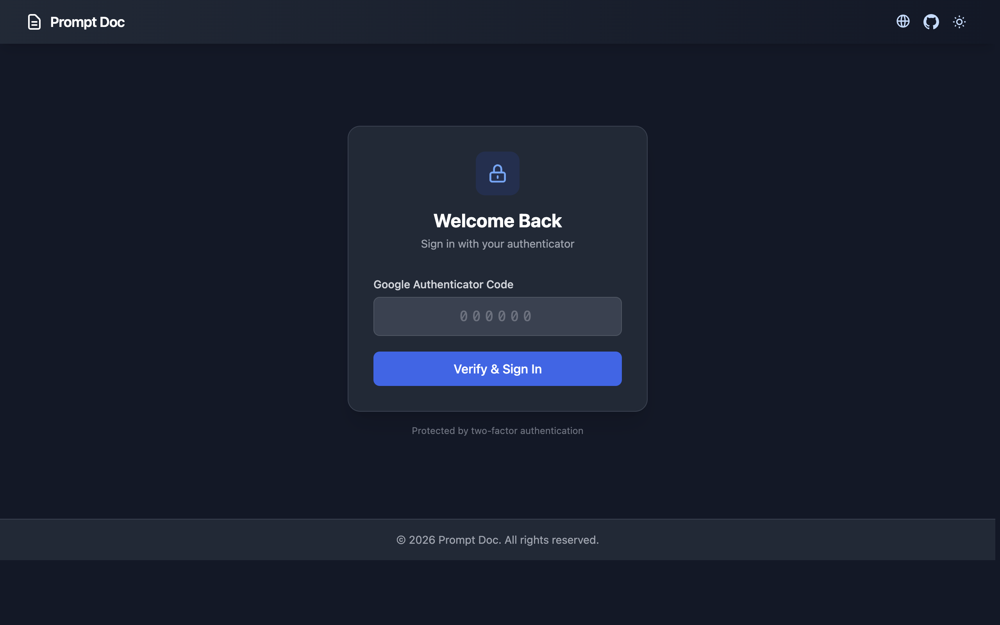
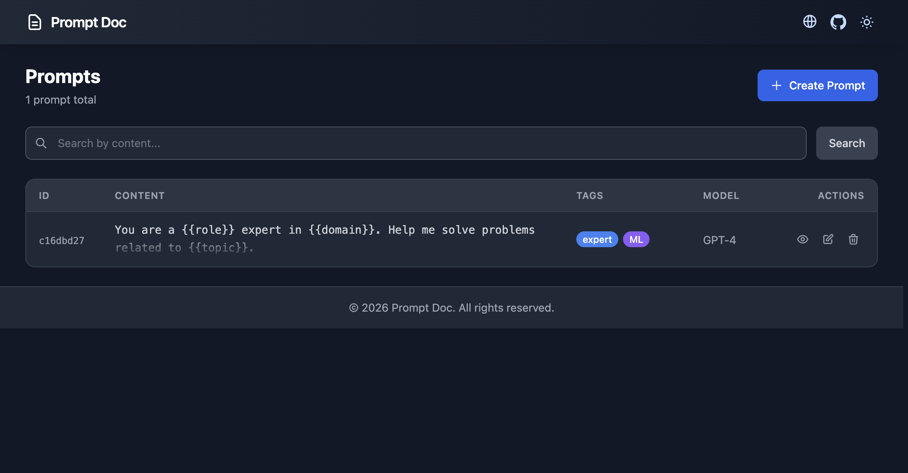
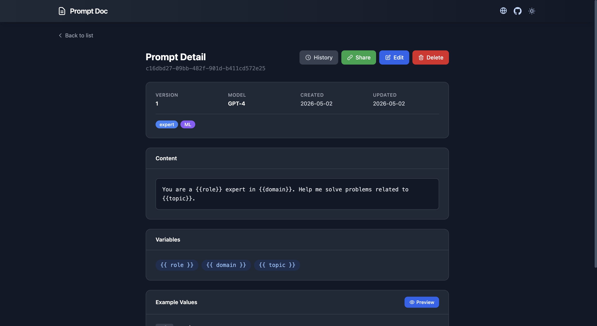

[中文](README_ZH.md) | English

<div align="center">

# PromptDoc

**Prompt Version Control & Sharing Platform**

[](LICENSE)
[](https://python.org)
[](https://flask.palletsprojects.com)
[](https://www.mongodb.com)

Prompts scatter across chat logs, documents, and code comments. Versions blur together, changes go untracked, and sharing means copy-pasting or screenshots.

**PromptDoc is the missing infrastructure for prompt engineering** — version history with line-level diffs, one-click sharing links, variable preview, and a full REST API. Everything you need to treat prompts as first-class assets.

</div>

## Screenshots

| Login | Prompt List |
|:---:|:---:|
|  |  |

| Detail · Version History · Sharing |
|:---:|
|  |

## Features

- **Version History with Diffs** — Every edit or deletion auto-saves a snapshot. Browse history and see field-level changes with line-by-line content diffs highlighted in red/green.
- **Public Sharing Links** — Generate a share link with one click. Recipients can view prompt content, applicable models, and tags without logging in. Revoke anytime.
- **Variable Preview** — Use `{{variable}}` placeholders in prompts. Fill in example values and preview the rendered output instantly — no manual substitution needed.
- **Bilingual UI** — Switch between English and Chinese with one click. Preference persists via cookie.
- **REST API** — Full CRUD operations over HTTP with Bearer Token authentication. Integrate directly into your existing workflows.
- **TOTP Two-Factor Authentication** — Admin dashboard secured with Google Authenticator. No shared passwords.

## Quick Start

**1. Install dependencies**

```bash
git clone https://github.com/worldwonderer/promptdoc.git
cd promptdoc
pip install -r requirements.txt
```

**2. Configure environment variables**

```bash
export MONGODB_HOST="mongodb://localhost:27017/prompt"
export SECRET_KEY="any-random-string"
```

**3. Generate TOTP secret**

```bash
python tool.py
```

Scan the output QR code with Google Authenticator, then:

```bash
export ADMIN_SECRET="secret-from-tool-output"
export AUTH_TOKEN="your-custom-api-token"
```

**4. Run**

```bash
python debug.py
```

Open `http://127.0.0.1:5000` and log in with your Google Authenticator code.

## API Reference

All endpoints require `Authorization: Bearer YOUR_TOKEN` unless noted otherwise.

```bash
# List prompts (paginated, searchable, tag-filterable)
curl "http://127.0.0.1:5000/api/prompts?page=1&per_page=10&search=keyword" \
  -H "Authorization: Bearer YOUR_TOKEN"

# Create a prompt
curl -X POST "http://127.0.0.1:5000/api/prompt" \
  -H "Authorization: Bearer YOUR_TOKEN" \
  -H "Content-Type: application/json" \
  -d '{"content":"You are a {{role}}.","variables":["role"],"version":"1","applicable_llm":"GPT-4","tags":["test"]}'

# View version history
curl "http://127.0.0.1.5000/api/prompt/PROMPT_ID/versions" \
  -H "Authorization: Bearer YOUR_TOKEN"

# Diff between versions
curl "http://127.0.0.1:5000/api/prompt/PROMPT_ID/versions/VERSION_ID/diff" \
  -H "Authorization: Bearer YOUR_TOKEN"

# Access shared prompt (no auth required)
curl "http://127.0.0.1:5000/api/share/SHARE_TOKEN"
```

## Configuration

| Variable | Required | Description |
|----------|:--------:|-------------|
| `MONGODB_HOST` | Yes | MongoDB connection URI |
| `SECRET_KEY` | Yes | Flask session secret |
| `ADMIN_SECRET` | Yes | TOTP secret (generated by `tool.py`) |
| `AUTH_TOKEN` | Yes | API bearer token |
